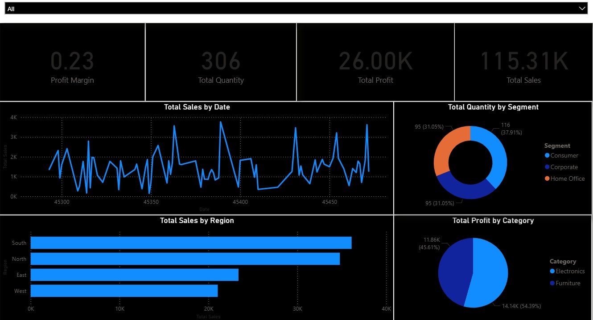

# PowerBI-SalesDashboard

📊 A Sales and Profit Analytics Dashboard built with **Power BI** to provide actionable insights across regions, categories, and customer segments.

---

## 📈 Dashboard Overview

This interactive dashboard includes:

- 💰 **Total Sales & Profit KPIs**
- 🧮 **Profit Margin & Quantity Sold**
- 📅 **Sales Trend Over Time**
- 🌍 **Sales by Region**
- 🛋️ **Profit by Product Category**
- 👥 **Quantity by Customer Segment**
- 🎛️ **Slicers for Region & Date Filtering**

---

## 📎 File Info

| File Name                      | Description                                |
|-------------------------------|--------------------------------------------|
| `SalesAnalyticsDashboard.pbix` | Power BI dashboard file (built with sample sales data) |

---

## 🛠️ Tools Used

- Power BI Desktop  
- DAX (for calculated measures)  
- Sample sales data (Excel format)

---

## 📸 Screenshots

---

## 🚀 How to Use

1. Download `SalesAnalyticsDashboard.pbix`
2. Open it in [Power BI Desktop](https://powerbi.microsoft.com/desktop/)
3. Explore or modify the visuals, measures, and filters
4. Optional: Replace the dataset with your own sales data

---

## 📬 Contact

**Tarun Sai Tirumala**  
📧 tarunsai28@gmail.com 
